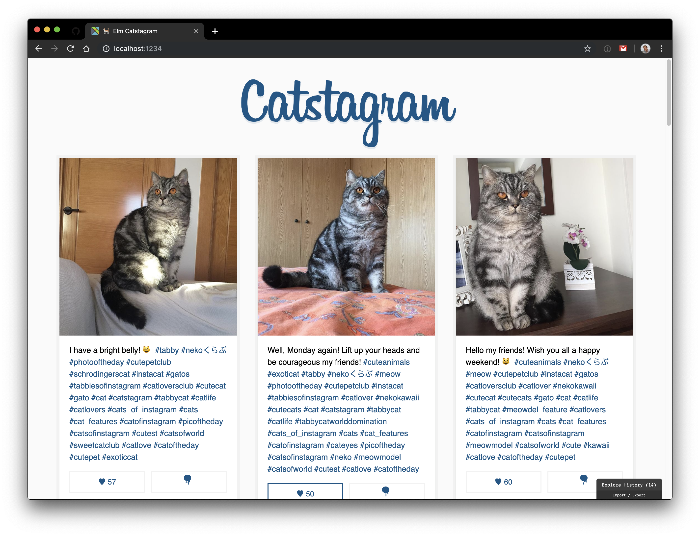

# elm-catstagram

Catstagram in Elm! 🌳🐈



## Local Development

```sh
$ npm i && npm start
```

## Usage

You need to get your own Instagram API_TOKEN and add a `.env` file:

```sh
# .env
API_TOKEN=xxxxxxxxxx.xxxxxxx.xxxxxxxxxxxxxxxxxxxxxxxxxxxxxxxx
```

## TODO

- [ ] Migrate to new API endpoints (thanks Instagram 🤦🏼‍♂️)
- [ ] Migrate as much CSS as possible to `elm-ui` 💅🏼
